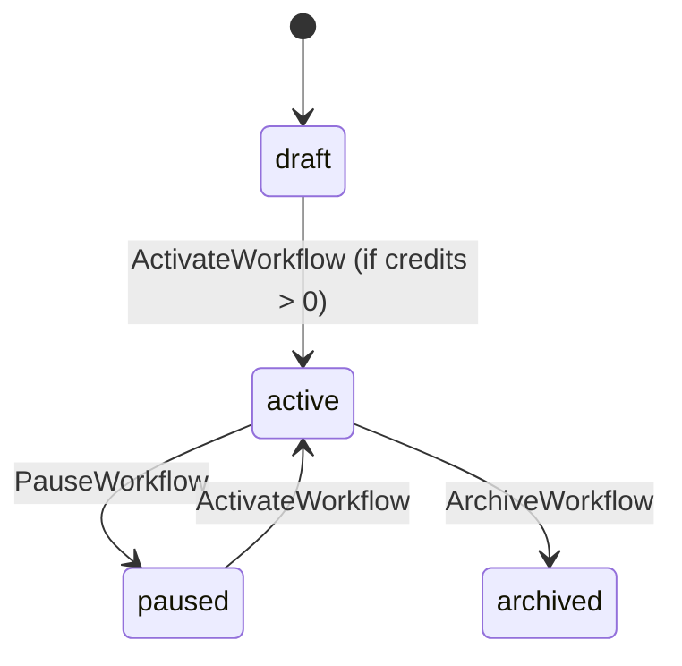

# 📂 dummy-zenflow.md

## 1. Domain Overview

ZenFlow는 기업용(Multi-tenant) 업무 자동화 SaaS입니다. 조직(Organization)은 워크플로우를 설계하고, 각 워크플로우는 여러 액션(Action)을 순차적으로 실행합니다. 모든 실행은 조직의 구독 플랜 및 잔여 크레딧에 종속됩니다.

## 2. Entity & DDL (`db/schema.sql`)

```sql
-- 조직 및 구독 관리
CREATE TABLE organizations (
    id UUID PRIMARY KEY DEFAULT gen_random_uuid(),
    name TEXT NOT NULL,
    plan_type TEXT CHECK (plan_type IN ('free', 'pro', 'enterprise')),
    credits_balance INTEGER DEFAULT 0
);

-- 사용자 (조직 종속)
CREATE TABLE users (
    id UUID PRIMARY KEY DEFAULT gen_random_uuid(),
    org_id UUID REFERENCES organizations(id),
    email TEXT UNIQUE NOT NULL,
    role TEXT CHECK (role IN ('admin', 'member'))
);

-- 워크플로우 엔진
CREATE TABLE workflows (
    id UUID PRIMARY KEY DEFAULT gen_random_uuid(),
    org_id UUID REFERENCES organizations(id),
    title TEXT NOT NULL,
    trigger_event TEXT NOT NULL, -- e.g., 'webhook_received'
    status TEXT NOT NULL DEFAULT 'draft',
    created_at TIMESTAMP DEFAULT CURRENT_TIMESTAMP
);

-- 워크플로우 상세 액션
CREATE TABLE actions (
    id UUID PRIMARY KEY DEFAULT gen_random_uuid(),
    workflow_id UUID REFERENCES workflows(id) ON DELETE CASCADE,
    type TEXT NOT NULL, -- e.g., 'send_email', 'http_request'
    payload_template JSONB,
    sequence_order INTEGER NOT NULL
);

-- 실행 로그 및 과금
CREATE TABLE execution_logs (
    id UUID PRIMARY KEY DEFAULT gen_random_uuid(),
    workflow_id UUID REFERENCES workflows(id),
    org_id UUID REFERENCES organizations(id),
    status TEXT,
    credits_spent INTEGER,
    executed_at TIMESTAMP DEFAULT CURRENT_TIMESTAMP
);

```

## 3. State Machine (`states/workflow.md`)



## 4. Authorization Rules (`policy/authz.rego`)

```rego
package authz

# @ownership organization: organizations.id
# @ownership workflow: workflows.org_id
# @ownership user_org: users.org_id

default allow = false

# 모든 요청은 같은 조직 내에서만 허용 (Multi-tenant Isolation)
is_same_org {
    input.user.org_id == input.resource.org_id
}

# 워크플로우 생성/수정: Admin만 가능
allow {
    input.operation == "CreateWorkflow"
    input.user.role == "admin"
}

# 워크플로우 실행 및 조회: 같은 조직 멤버면 가능
allow {
    input.operation == "ListWorkflows"
    is_same_org
}

# 워크플로우 활성화: Admin + 조직 소유
allow {
    input.operation == "ActivateWorkflow"
    input.user.role == "admin"
    is_same_org
}

```

## 5. API & Business Logic (`api/openapi.yaml`, `logic/workflow.ssac`)

### POST /workflows/{id}/activate (`ActivateWorkflow`)

* **Logic**:
1. 조직의 `credits_balance` 확인.
2. 0 이하면 `402 Payment Required` 반환.
3. 상태를 `active`로 변경.


### POST /workflows/{id}/execute (`ExecuteWorkflow`)

* **Logic**:
1. `@auth`로 조직 격리 확인.
2. `@state`로 워크플로우가 `active`인지 확인.
3. `db.query`로 연결된 모든 `actions`를 `sequence_order` 순으로 로드.
4. **@call `worker.processAction**` 루프 실행.
5. **@call `billing.deductCredit**` 호출 (성공 시 1크레딧 차감).
6. `execution_logs` 기록.


## 6. Custom Functions (`func/worker/*.go`, `func/billing/*.go`)

* `processAction(actionType, payload)`: 외부 API 호출 시뮬레이션.
* `checkCredits(orgID)`: 현재 잔액 반환.
* `deductCredit(orgID, amount)`: 원자적 크레딧 차감.

## 7. E2E Scenario (`scenario/automation.feature`)

* **@scenario**: Happy Path
* Admin이 워크플로우 생성 -> 액션 2개 추가 -> 활성화(성공) -> 실행 -> 로그 생성 및 크레딧 차감 확인.


* **@invariant**: Tenant Breach
* Org A의 사용자가 Org B의 `workflow_id`로 실행 요청 -> `403 Forbidden`.


* **@invariant**: Insufficient Credits
* 크레딧이 0인 조직이 활성화 시도 -> `402 Payment Required`.